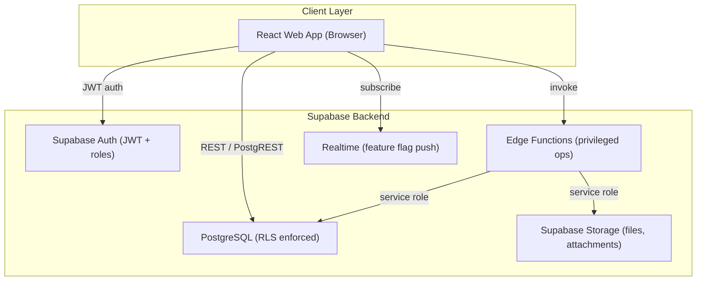
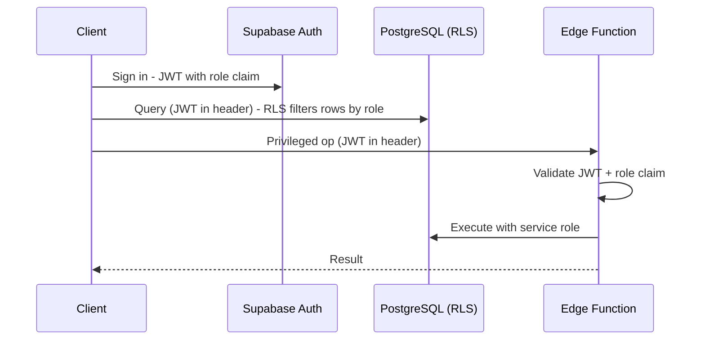
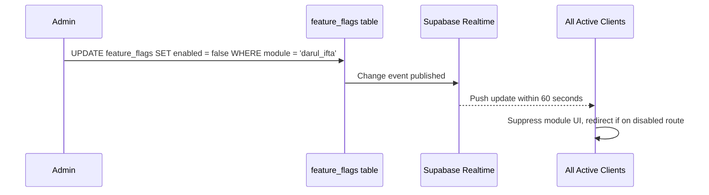

# Design Document: Hidayat

## Overview

The Hidayat is a full-stack digital ecosystem for managing an Islamic educational institution. It is architected as a **backend-config driven** platform — forms, reports, module availability, and eligibility rules are all stored as JSON in Supabase database tables and consumed at runtime by the frontend. This means the institution can reconfigure the system without redeploying code.

The system is deployed as a **React web application** (browser-based).

The backend is entirely **Supabase**: PostgreSQL for relational data, Row-Level Security (RLS) for per-role data isolation, Supabase Auth for identity, Supabase Storage for file attachments, and Supabase Edge Functions for privileged server-side operations.

### Key Design Principles

1. **Config-over-code**: All dynamic behavior (forms, reports, flags, rules) lives in the database, not in the frontend bundle.
2. **Defense in depth**: RLS enforces data isolation at the database layer; Edge Functions re-validate JWTs before any privileged mutation.
3. **Modular feature flags**: Each major module can be toggled on/off at runtime via the database.
4. **Audit everywhere**: Status transitions, role assignments, config changes, and Edge Function calls are all logged with actor and timestamp.

---

## Architecture

### High-Level Architecture



### Request Flow: Normal Operation



### Feature Flag Real-Time Flow



---

## Components and Interfaces

### Frontend Module Structure

```
src/
  app/
    router.jsx                  # Route definitions, feature-flag gating
    FeatureFlagProvider.jsx     # Fetches flags, subscribes to realtime updates
    RoleProvider.jsx            # Loads user role from DB on auth
    Layout.jsx                  # Sidebar navigation and page shell
    Dashboard.jsx               # Home screen with module cards
  modules/
    dars-e-nizami/              # Curriculum, enrollment, evaluation, transcripts
    hifz/                       # Juz tracking, revision cycles
    nazra/                      # Lesson sequence tracking
    short-courses/              # Course CRUD, enrollment, certificates
    darul-ifta/                 # Question submission, fatwa workflow
    research-center/            # Publication submission, repository search
    wazifa/                     # Eligibility evaluation, disbursement reports
    student-admin/              # Student profiles, lifecycle, bulk ops
    scholar-admin/              # Scholar profiles, assignments
    reports/                    # Schema-driven report renderer
  shared/
    DynamicForm/                # JSON-schema to React form renderer
    ReportRenderer/             # JSON-schema to table/PDF/CSV renderer
```

### Key Shared Components

#### DynamicForm

Renders a form from a JSON schema fetched from `form_schemas`. Supports all required field types and conditional visibility.

```typescript
interface FormSchema {
  id: string;
  version: number;
  fields: FormField[];
}

interface FormField {
  key: string;
  label: string;
  type: 'text' | 'number' | 'date' | 'select' | 'multi-select' | 'file' | 'textarea' | 'boolean';
  required: boolean;
  options?: { value: string; label: string }[];
  visibleWhen?: { field: string; equals: unknown };
  validation?: { min?: number; max?: number; pattern?: string; message?: string };
}
```

#### FeatureFlagProvider

Fetches all feature flags on app init, exposes them via React context, and subscribes to Supabase Realtime for live updates within 60 seconds.

```typescript
interface FeatureFlags {
  dars_e_nizami: boolean;
  hifz: boolean;
  nazra: boolean;
  short_courses: boolean;
  darul_ifta: boolean;
  research_center: boolean;
  wazifa: boolean;
  student_reports: boolean;
}
```

#### ReportRenderer

Fetches a report schema from `report_schemas`, calls the designated Edge Function for data, and renders as table, PDF, or CSV.

```typescript
interface ReportSchema {
  id: string;
  title: string;
  query_function: string;
  columns: ReportColumn[];
  empty_state_message: string;
  export_formats: ('table' | 'pdf' | 'csv')[];
}
```

### Edge Functions

| Function | Purpose | Authorized Roles |
|---|---|---|
| `bulk-student-update` | Bulk status/program changes | Admin |
| `promote-student` | Promote to next Dars-e-Nizami level | Admin, Scholar |
| `evaluate-wazifa` | Run wazifa eligibility rules | Admin |
| `generate-report` | Execute report query | Admin, Scholar |
| `publish-fatwa` | Approve and publish a fatwa | Admin, Mufti |
| `assign-fatwa` | Assign question to a Mufti | Admin, Mufti |
| `generate-certificate` | Render short course certificate PDF | Admin |
| `config-update` | Write to any Config Table | Admin only |

All Edge Functions follow this pattern:
1. Extract and verify JWT from `Authorization` header; return 401 if invalid/expired
2. Decode role claim; return 403 if insufficient
3. Execute operation using service-role Supabase client
4. Log invocation (user_id, function name, timestamp, success/failure)
5. Return result or structured error

---

## Data Models

### Core Identity Tables

```sql
-- Extends Supabase Auth users with role
profiles (
  id          uuid PRIMARY KEY REFERENCES auth.users(id),
  role        text NOT NULL CHECK (role IN ('admin','scholar','mufti','student')),
  full_name   text NOT NULL,
  created_at  timestamptz DEFAULT now()
)

students (
  id                uuid PRIMARY KEY DEFAULT gen_random_uuid(),
  profile_id        uuid REFERENCES profiles(id),
  enrollment_number text UNIQUE NOT NULL,
  date_of_birth     date,
  gender            text,
  contact_info      jsonb,
  guardian_info     jsonb,
  enrollment_date   date NOT NULL,
  status            text NOT NULL CHECK (status IN ('active','suspended','graduated','withdrawn')),
  created_at        timestamptz DEFAULT now()
)

scholars (
  id                uuid PRIMARY KEY DEFAULT gen_random_uuid(),
  profile_id        uuid REFERENCES profiles(id),
  qualifications    text[],
  specializations   text[],
  contact_info      jsonb,
  employment_status text NOT NULL CHECK (employment_status IN ('active','inactive')),
  created_at        timestamptz DEFAULT now()
)
```

### Config Tables

```sql
form_schemas (
  id          uuid PRIMARY KEY DEFAULT gen_random_uuid(),
  form_key    text UNIQUE NOT NULL,
  version     integer NOT NULL DEFAULT 1,
  schema      jsonb NOT NULL,
  updated_at  timestamptz DEFAULT now(),
  updated_by  uuid REFERENCES profiles(id)
)

feature_flags (
  id          uuid PRIMARY KEY DEFAULT gen_random_uuid(),
  module      text UNIQUE NOT NULL,
  enabled     boolean NOT NULL DEFAULT true,
  updated_at  timestamptz DEFAULT now(),
  updated_by  uuid REFERENCES profiles(id)
)

report_schemas (
  id          uuid PRIMARY KEY DEFAULT gen_random_uuid(),
  report_key  text UNIQUE NOT NULL,
  schema      jsonb NOT NULL,
  updated_at  timestamptz DEFAULT now(),
  updated_by  uuid REFERENCES profiles(id)
)

wazifa_rules (
  id          uuid PRIMARY KEY DEFAULT gen_random_uuid(),
  version     integer NOT NULL DEFAULT 1,
  rules       jsonb NOT NULL,
  active      boolean NOT NULL DEFAULT true,
  updated_at  timestamptz DEFAULT now(),
  updated_by  uuid REFERENCES profiles(id)
)
```

### Academic Program Tables

```sql
-- Dars-e-Nizami
dars_e_nizami_levels (
  id               uuid PRIMARY KEY DEFAULT gen_random_uuid(),
  name             text NOT NULL,
  sequence_order   integer NOT NULL,
  passing_threshold numeric NOT NULL DEFAULT 50
)

dars_e_nizami_subjects (
  id       uuid PRIMARY KEY DEFAULT gen_random_uuid(),
  level_id uuid REFERENCES dars_e_nizami_levels(id),
  name     text NOT NULL
)

student_enrollments (
  id          uuid PRIMARY KEY DEFAULT gen_random_uuid(),
  student_id  uuid REFERENCES students(id),
  program     text NOT NULL,
  level_id    uuid REFERENCES dars_e_nizami_levels(id) NULL,
  enrolled_at date NOT NULL,
  status      text NOT NULL DEFAULT 'active'
)

evaluations (
  id           uuid PRIMARY KEY DEFAULT gen_random_uuid(),
  student_id   uuid REFERENCES students(id),
  subject_id   uuid REFERENCES dars_e_nizami_subjects(id),
  level_id     uuid REFERENCES dars_e_nizami_levels(id),
  scholar_id   uuid REFERENCES scholars(id),
  score        numeric NOT NULL,
  evaluated_at date NOT NULL,
  flagged      boolean NOT NULL DEFAULT false
)

-- Hifz
hifz_progress (
  id           uuid PRIMARY KEY DEFAULT gen_random_uuid(),
  student_id   uuid REFERENCES students(id),
  juz_number   integer NOT NULL CHECK (juz_number BETWEEN 1 AND 30),
  status       text NOT NULL CHECK (status IN ('not_started','in_progress','memorized','revised')),
  memorized_at date,
  scholar_id   uuid REFERENCES scholars(id),
  UNIQUE (student_id, juz_number)
)

hifz_audit_log (
  id          uuid PRIMARY KEY DEFAULT gen_random_uuid(),
  student_id  uuid REFERENCES students(id),
  juz_number  integer NOT NULL,
  old_status  text,
  new_status  text NOT NULL,
  changed_by  uuid REFERENCES profiles(id),
  changed_at  timestamptz DEFAULT now()
)

-- Nazra
nazra_lessons (
  id             uuid PRIMARY KEY DEFAULT gen_random_uuid(),
  sequence_order integer NOT NULL,
  title          text NOT NULL
)

nazra_progress (
  id           uuid PRIMARY KEY DEFAULT gen_random_uuid(),
  student_id   uuid REFERENCES students(id),
  lesson_id    uuid REFERENCES nazra_lessons(id),
  completed_at date NOT NULL,
  scholar_id   uuid REFERENCES scholars(id),
  quality_note text,
  UNIQUE (student_id, lesson_id)
)

-- Short Courses
short_courses (
  id                   uuid PRIMARY KEY DEFAULT gen_random_uuid(),
  title                text NOT NULL,
  description          text,
  duration_weeks       integer,
  fee                  numeric,
  start_date           date,
  end_date             date,
  certificate_template text,
  created_by           uuid REFERENCES profiles(id)
)

short_course_enrollments (
  id           uuid PRIMARY KEY DEFAULT gen_random_uuid(),
  course_id    uuid REFERENCES short_courses(id),
  student_id   uuid REFERENCES students(id),
  enrolled_at  date NOT NULL,
  payment_ref  text,
  status       text NOT NULL DEFAULT 'active',
  completed_at date
)
```

### Darul Ifta Tables

```sql
fatwa_questions (
  id               uuid PRIMARY KEY DEFAULT gen_random_uuid(),
  reference_number text UNIQUE NOT NULL,
  submitted_by     uuid REFERENCES profiles(id),
  question_text    text NOT NULL,
  context          text,
  status           text NOT NULL CHECK (status IN ('pending','assigned','under_review','approved','published','closed')),
  assigned_mufti   uuid REFERENCES profiles(id) NULL,
  duplicate_of     uuid REFERENCES fatwa_questions(id) NULL,
  created_at       timestamptz DEFAULT now()
)

fatwa_responses (
  id            uuid PRIMARY KEY DEFAULT gen_random_uuid(),
  question_id   uuid REFERENCES fatwa_questions(id),
  mufti_id      uuid REFERENCES profiles(id),
  response_text text NOT NULL,
  submitted_at  timestamptz DEFAULT now()
)

fatwa_audit_log (
  id          uuid PRIMARY KEY DEFAULT gen_random_uuid(),
  question_id uuid REFERENCES fatwa_questions(id),
  old_status  text,
  new_status  text NOT NULL,
  actor_id    uuid REFERENCES profiles(id),
  acted_at    timestamptz DEFAULT now()
)
```

### Research Center Tables

```sql
publications (
  id               uuid PRIMARY KEY DEFAULT gen_random_uuid(),
  title            text NOT NULL,
  abstract         text,
  authors          text[],
  publication_type text NOT NULL CHECK (publication_type IN ('paper','book','article')),
  file_path        text,
  status           text NOT NULL CHECK (status IN ('under_review','published','rejected')),
  submitted_by     uuid REFERENCES profiles(id),
  submitted_at     timestamptz DEFAULT now(),
  download_count   integer NOT NULL DEFAULT 0
)
```

### Wazifa Tables

```sql
wazifa_evaluations (
  id              uuid PRIMARY KEY DEFAULT gen_random_uuid(),
  student_id      uuid REFERENCES students(id),
  rule_version    integer NOT NULL,
  eligible        boolean NOT NULL,
  stipend_amount  numeric,
  evaluated_at    timestamptz DEFAULT now()
)
```

### Audit / Status History Tables

```sql
student_status_history (
  id          uuid PRIMARY KEY DEFAULT gen_random_uuid(),
  student_id  uuid REFERENCES students(id),
  old_status  text,
  new_status  text NOT NULL,
  changed_by  uuid REFERENCES profiles(id),
  changed_at  timestamptz DEFAULT now()
)

edge_function_log (
  id            uuid PRIMARY KEY DEFAULT gen_random_uuid(),
  function_name text NOT NULL,
  caller_id     uuid REFERENCES profiles(id),
  operation     text,
  success       boolean NOT NULL,
  invoked_at    timestamptz DEFAULT now()
)
```

### RLS Policy Summary

| Table | Student can read | Scholar can read | Admin can read/write |
|---|---|---|---|
| `students` | Own row only | Assigned students | All |
| `evaluations` | Own rows | Rows they authored | All |
| `hifz_progress` | Own rows | Assigned students | All |
| `nazra_progress` | Own rows | Assigned students | All |
| `fatwa_questions` | Own submissions | All (if Mufti) | All |
| `publications` | Published only | Own + published | All |
| `form_schemas` | Read only | Read only | Read + write |
| `feature_flags` | Read only | Read only | Read + write |
| `report_schemas` | Read only | Read only | Read + write |
| `wazifa_rules` | No access | No access | Read + write |

---

## Correctness Properties

*A property is a characteristic or behavior that should hold true across all valid executions of a system — essentially, a formal statement about what the system should do. Properties serve as the bridge between human-readable specifications and machine-verifiable correctness guarantees.*

